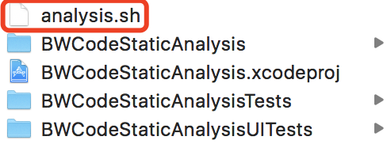
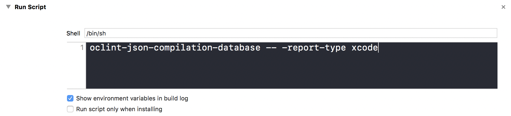
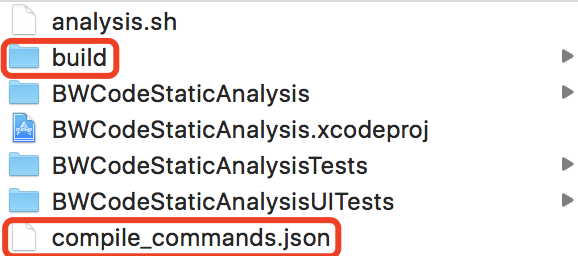

# Code Static Analysis

代码静态检查

Objective-C代码静态检查工具——OCLint

## Contents

- Overview
- OCLint
- Summary
- Next
- Reference

## Overview

编写符合项目团队规范的代码

检查项目代码质量

提高项目的可维护性

## OCLint

对C、C++、Objective-C进行静态代码检查的工具

### 给Xcode项目集成OCLint

#### 1、安装工具

必要的工具：OCLint、xcpretty（美化xcodebuild的命令行输出）

选择性安装：Homebrew（The missing package manager for macOS

），Mac OS的包管理器，可以方便安装很多常用工具

资源下载地址

OCLint：https://github.com/oclint/oclint/releases，选择最新的版本进行下载

xcpretty：https://github.com/supermarin/xcpretty，安装命令：gem install xcpretty，首先要安装有gem

Homebrew：https://brew.sh/，安装命令：/usr/bin/ruby -e "$(curl -fsSL https://raw.githubusercontent.com/Homebrew/install/master/install)"

#### 2、脚本配置

##### 在项目根目录下创建用于分析的Shell脚本文件analysis.sh，以下为文件内的脚本

```shell
# 移除原有的生成文件
xcodebuild clean | xcpretty
rm -r build
rm -r compile_commands.json

# Build和把日志写到目标文件
xcodebuild | xcpretty -r json-compilation-database --output compile_commands.json
```

##### Xcode -> Build Phases -> New Run Script Phase -> Run Script，配置生成代码不规范相关警告的Shell脚本

```shell
oclint-json-compilation-database -- -report-type xcode
```

**说明：**不建议直接在项目源码中进行静态代码检查，最好拷贝出一份代码来进行检查；如果要在项目源码中进行代码检查，那么在检查的时候才开启上述Xcode里面配置的脚本，不需要进行检查，打包测试，提交到Git上的时候记得把检查脚本注释掉，不然在Build之前都会先执行分析脚本

##### 图示





#### 3、使用

##### 在命令行切换到项目根目录，运行analysis.sh，生成build目录和用于生成警告的compile_commands.json文件



##### 对Xcode项目进行Command+B操作，稍等片刻，就能查看到由于编码不规范生成的警告

## Summary

对项目代码质量进行周期性检查

即使修改不符合规范的代码

## Next

- OCLint检查规则的熟悉，屏蔽掉OCLint不合适的检查规则
- 自定义OCLint的检查规则

## Reference

OCLint

http://oclint.org/

http://docs.oclint.org/en/stable/

http://docs.oclint.org/en/stable/guide/xcode.html