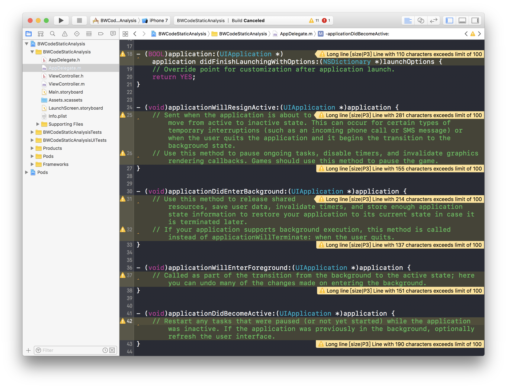

# Code Static Analysis

代码静态检查

Objective-C代码静态检查工具——OCLint

## Contents

- Overview
- OCLint
- Summary
- Next
- Reference

## Overview

编写符合项目团队规范的代码

## OCLint

对C、C++、Objective-C进行静态代码检查的工具

### 给Xcode项目集成OCLint

1、安装必要的工具：OCLint、xcpretty ，选择性安装：Homebrew，Mac OS的包管理器，可以方便安装很多常用工具

2、在项目根目录下创建用于分析的Shell脚本文件analysis.sh，以下为文件内的脚本

```shell
# 移除原有的生成文件
xcodebuild clean | xcpretty
rm -r build
rm -r compile_commands.json

# Build和把日志写到目标文件
xcodebuild | xcpretty -r json-compilation-database --output compile_commands.json
```

3、Xcode -> Build Phases -> New Run Script Phase -> Run Script，配置生成代码不规范相关警告的Shell脚本

```shell
oclint-json-compilation-database -- -report-type xcode
```

4、使用，先执行analysis.sh，之后再对项目进行Command+B操作，稍等片刻，就能查看到由于编码不规范生成的警告

## Summary

对项目代码质量进行周期性检查

## Next

- OCLint检查规则的熟悉
- 编写自家项目的OCLint检查规则

## Reference

OCLint

http://oclint.org/

http://docs.oclint.org/en/stable/

http://docs.oclint.org/en/stable/guide/xcode.html